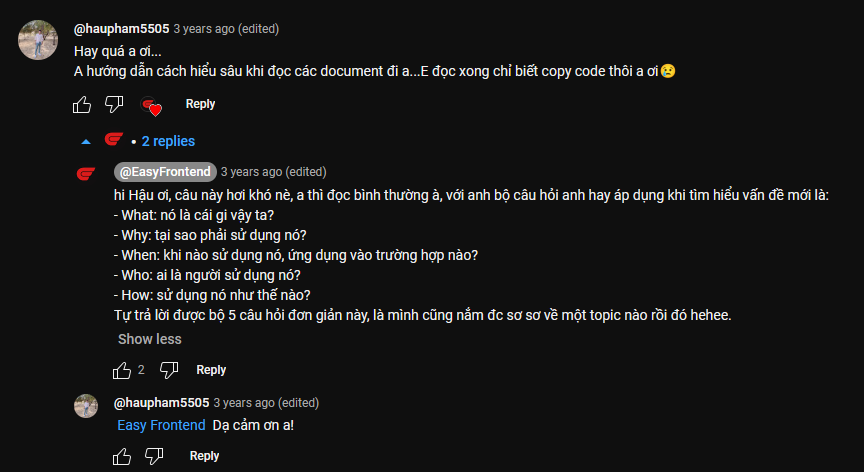
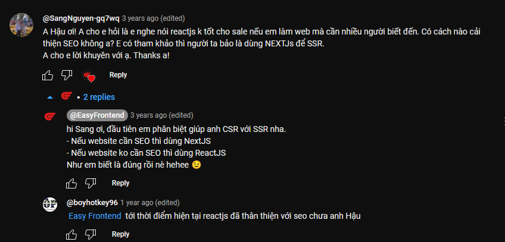
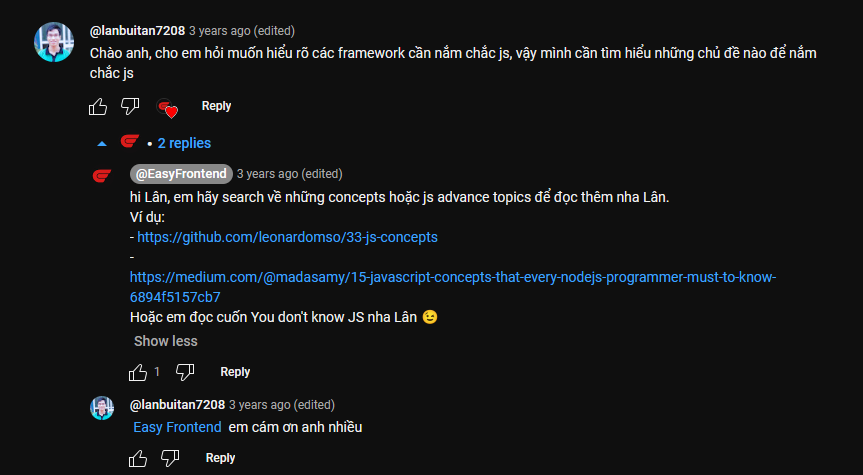
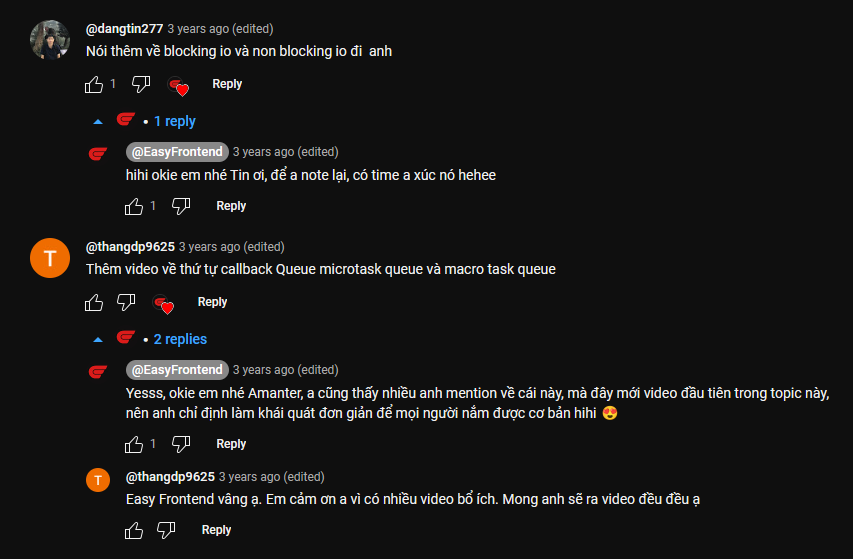

Bạn có từng nghe tới callstack, callback queue hay event loop chưa, hãy cũng mình tìm hiểu để biết được cách hoạt động của javascript runtime nha 🤩

Trong video này mình sẽ cùng chia sẻ với các bạn:

✅ Callstack, Callback queue và Event Loop là gì?
✅ Mỗi lần chạy lệnh bất đồng bộ như setTimeout, gọi API, thì nó sẽ được chạy thế nào?
✅ Thấu hiểu lý do tại sao cứ xài setTimeout là code luôn luôn được chạy sau cùng 🤣

Hi vọng qua video này, các bạn sẽ nắm được cách mà javascript runtime hoạt động như thế nào? 😊

#javascript
#javascript_runtime_works
#javascript_event_loop

🌐 Link tham khảo:

- Loupe (Javascript runtime visualization): https://bit.ly/2FMtkZH

**Những câu hỏi hay ở bình luận trong video**

[Link 1](https://github.com/leonardomso/33-js-concepts)

[Link 2](https://madasamy.medium.com/15-javascript-concepts-that-every-nodejs-programmer-must-to-know-6894f5157cb7)

