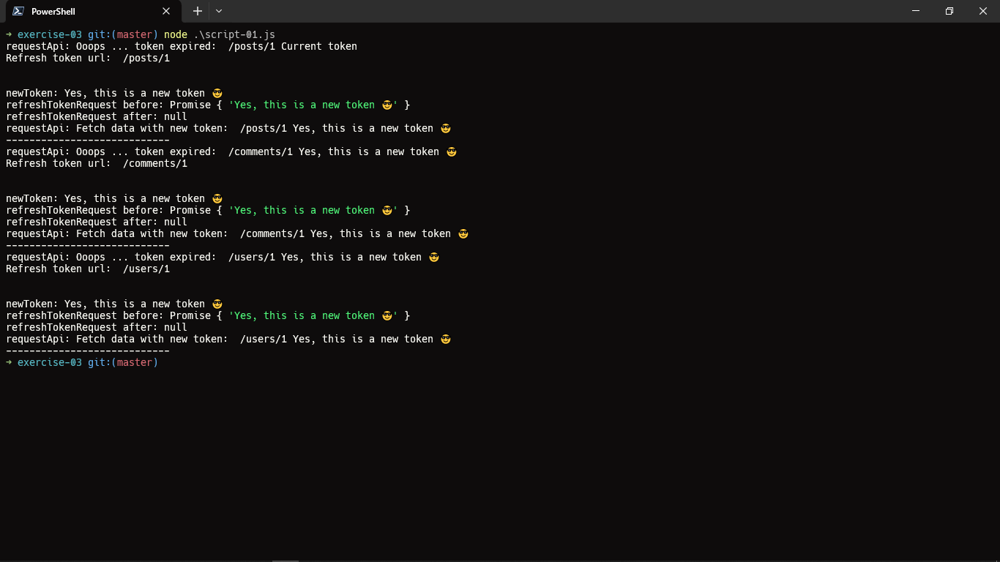

# Result of file code script-01.js

In this case, I have variable `isTokenExpired = true`, so it will send request to server, then take api and return with new token

With each request it will await 3 seconds, then it execute next request, still for finished request

