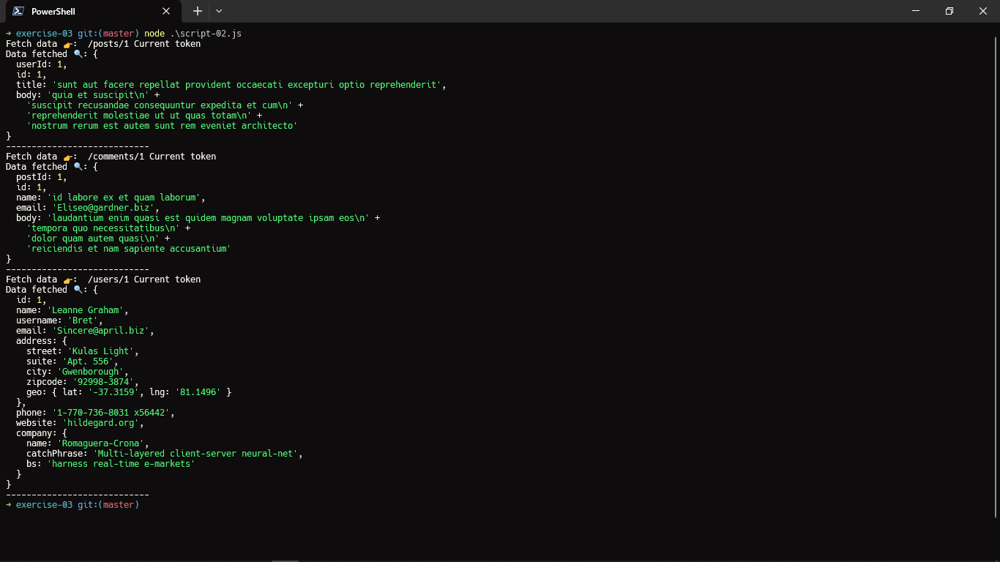

# Result of file code script-02.js

This file have `isTokenExpired = false` so it not run in statement `if else`. Then it run down this code

```js
// Simulate fetching data from JSONPlaceholder
const response = await fetch(`https://jsonplaceholder.typicode.com${url}`)
const data = await response.json()
```

and it will execute 3 api that is `posts` `comments` `users`


