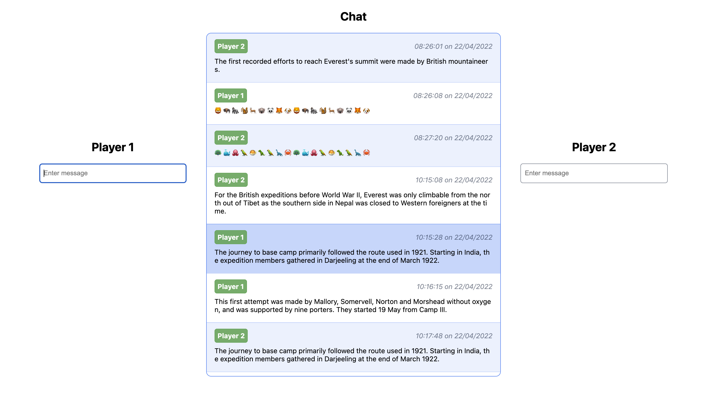
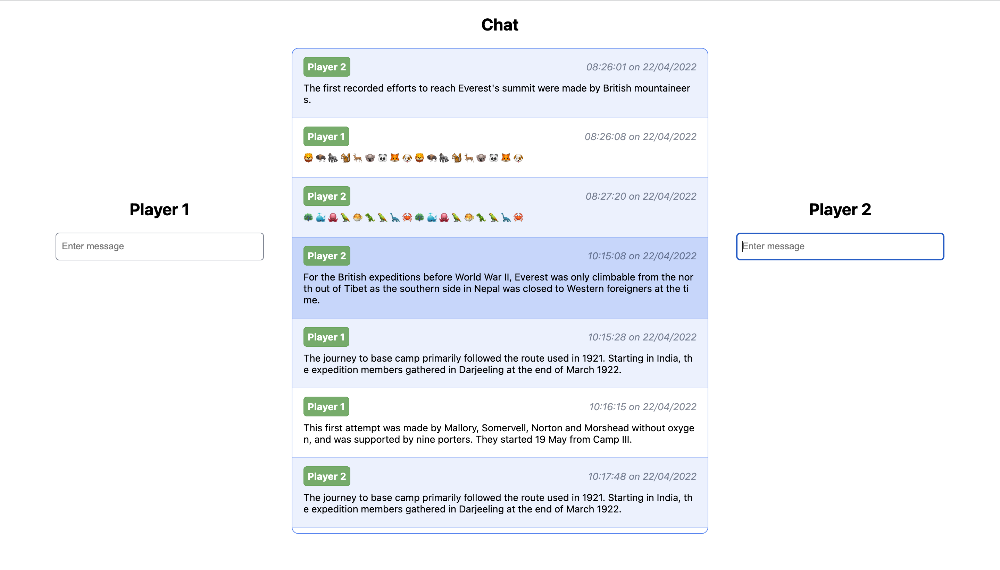
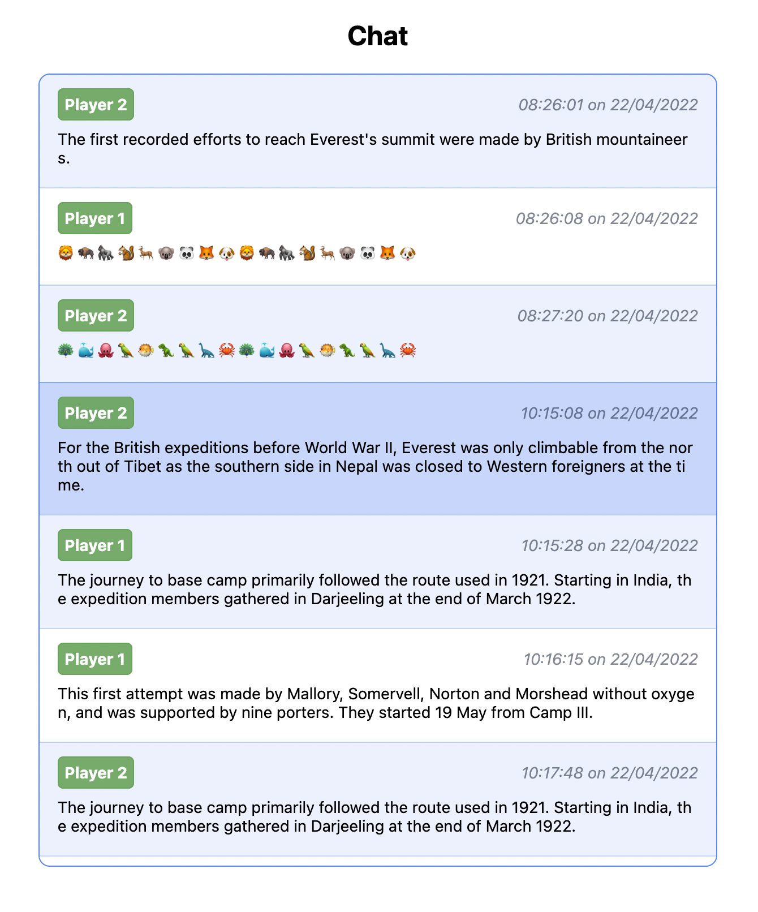

# Chat App made with React.js - 2022

The Chat App offers the opportunity to have conversations on the Web with multiple people.

### Technologies:

- React.js
- Typescript
- Firestore
- Styled-components
- HTML, CSS

### Preview:

### Participants

- © Paul Panaitescu (https://github.com/panaitescu-paul)
- © Joachim Koenigslieb (https://github.com/JoachimKoenigslieb)
