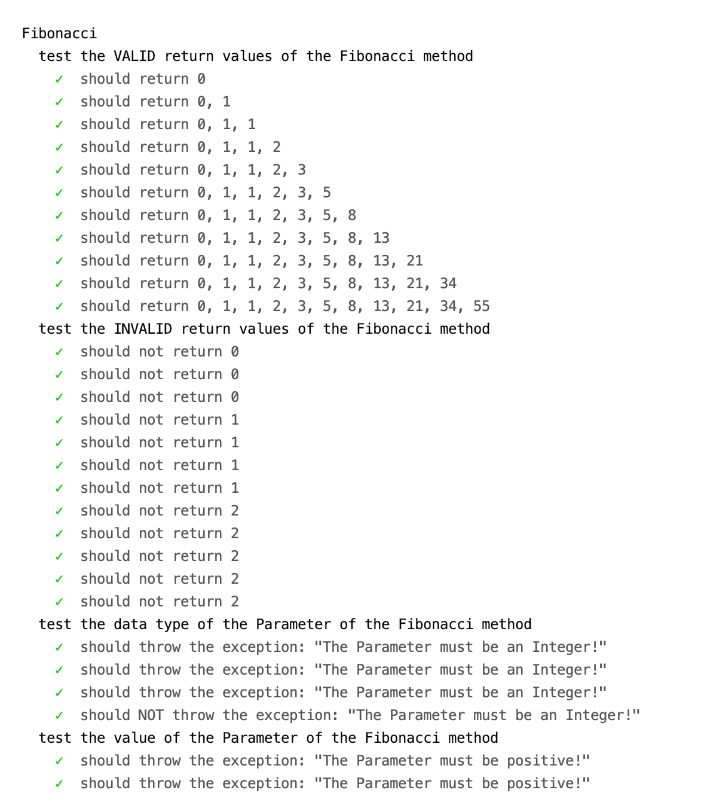
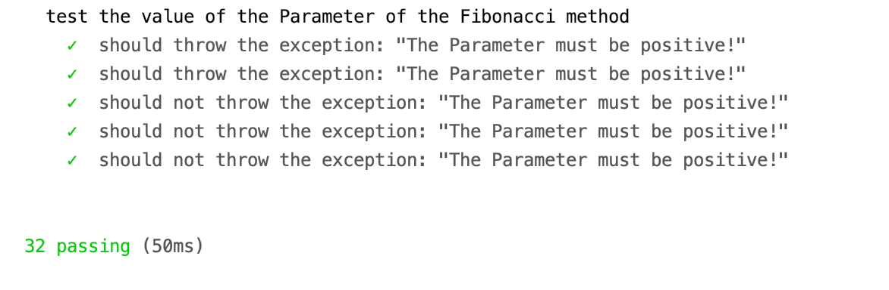

# Test Driven Development - Fibonacci Sequence - JavaScript - 2020

A **_TDD (Test Driven Development)_** approach for writing the Fibonacci Sequence, using JavaScript, Mocha, and Chai. This was done by **_first creating the tests for a feature, then writing the minimum code to pass the tests_**. The process was repeated for the remaining features.

## Content:

- **_32 Unit Tests_**
- Implementation of the **_Fibonacci Sequence_**

## Technologies:

- JavaScript
- Mocha
- Chai

## Unit Tests Overview:

 

  
  

