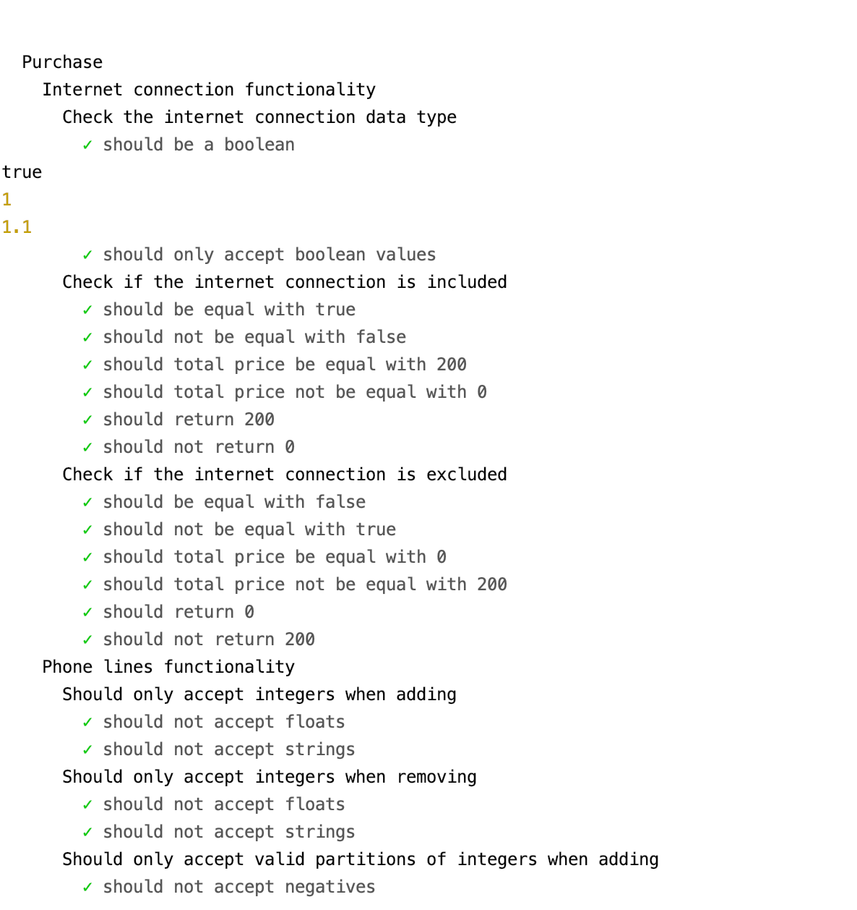
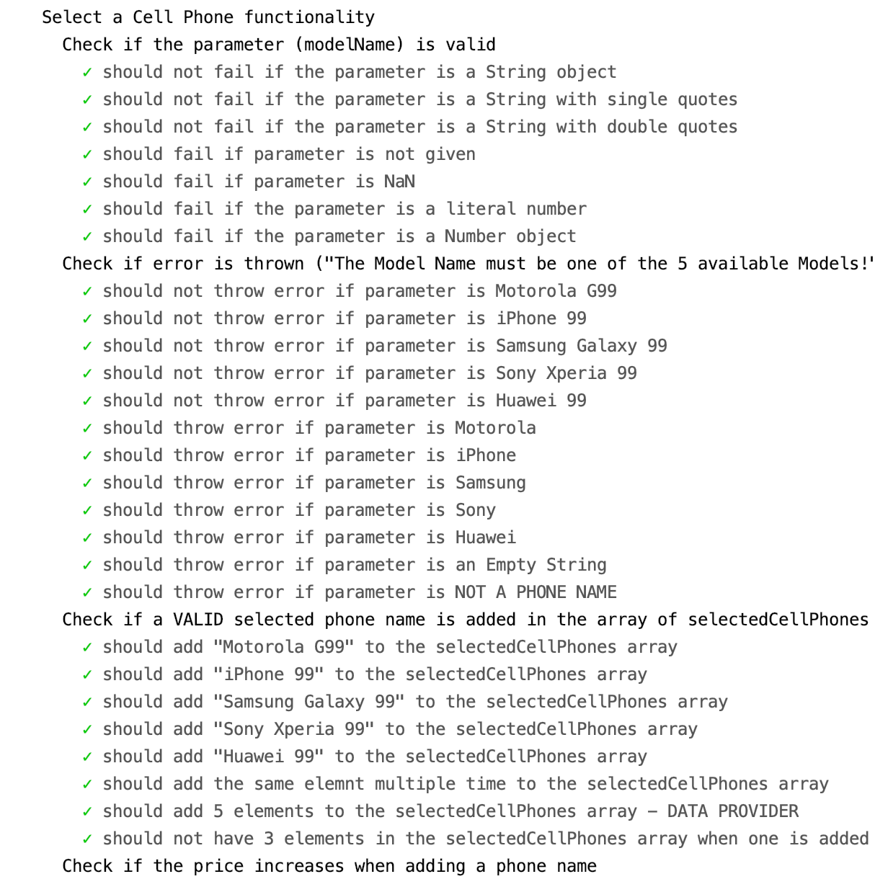
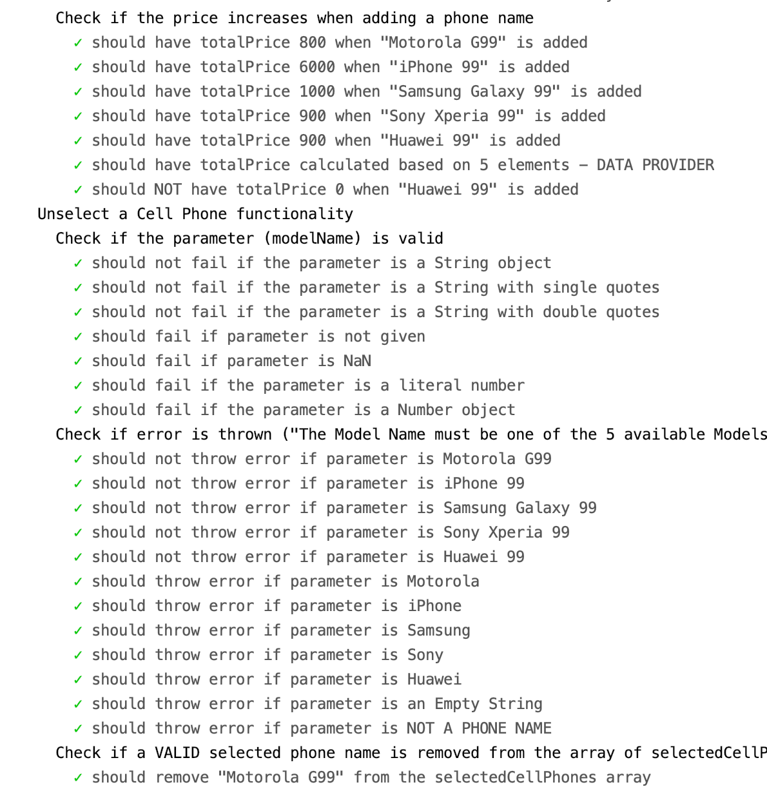
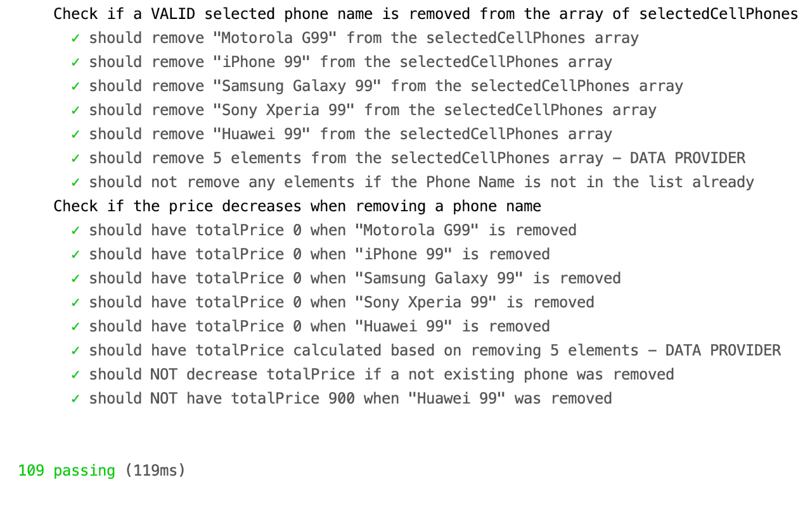

# Unit Testing And Integration Testing - JavaScript - 2 - 2020

**_Unit tests_** to verify the **_Valid cases, Invalid cases, and Exceptions_** using JavaScript, Mocha, and Chai.

## Features:

- **_Data providers_**
- Test for **_Equivalence Partitioning_** (both Valid and Invalid Partitions)
- Test for **_Boundary Values_**

## Content:

- **_109 Unit Tests_**
- **_Integration tests_** with GitHub Actions

## Technologies:

- JavaScript
- HTML
- Mocha
- Chai

## Unit Tests Overview:

 

  
  
  
  
  

