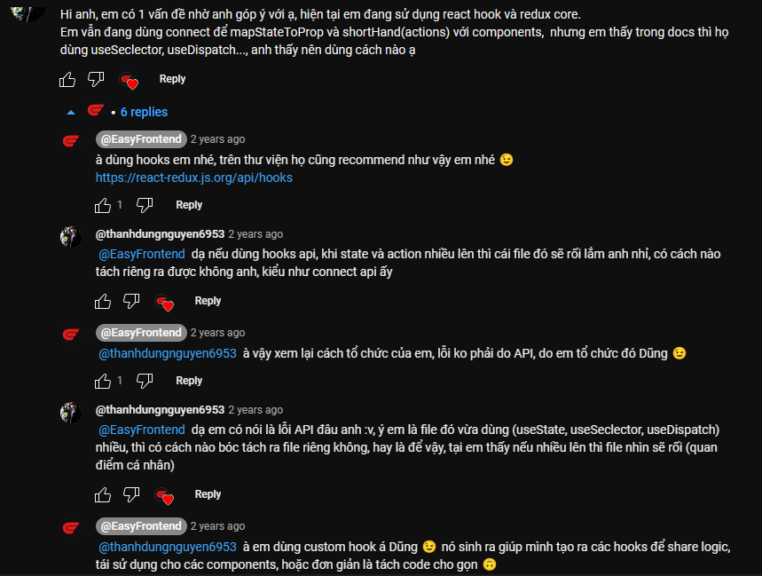

React hooks ra đời đã giúp functional component trở nên powerful hơn bao giờ hết! 😍Trước đây khi cần dùng đến các tính năng của React như state, life cycle thì mình bắt buộc phải dùng class component. Nhưng giờ thì đã khác, có hooks, functional component như hổ mọc thêm cánh, có thể xử lý được state, life cycle và những thứ khác của React một cách êm đềm.

Cùng mình xem hết videos để khám phá những điều thú vị từ React hooks nhé! 😉

Đây là video đầu tiên trong chuỗi videos nói về React Hooks.
Hãy like và subscribe kênh của mình để nhận được thông báo khi có video mới nhé! ❤️

Link tham khảo:

- Introduction to react hooks: https://legacy.reactjs.org/docs/hooks-intro.html
- React hooks API reference: https://legacy.reactjs.org/docs/hooks-reference.html
- React hooks FAQ: https://reactjs.org/docs/hooks-faq.html

**Những bình luận hay**

