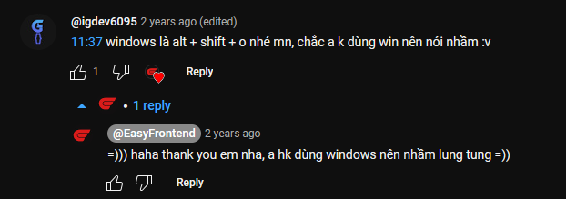
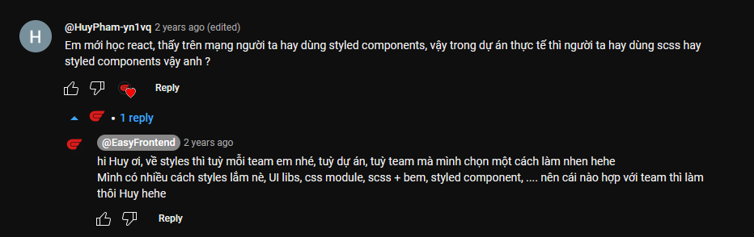
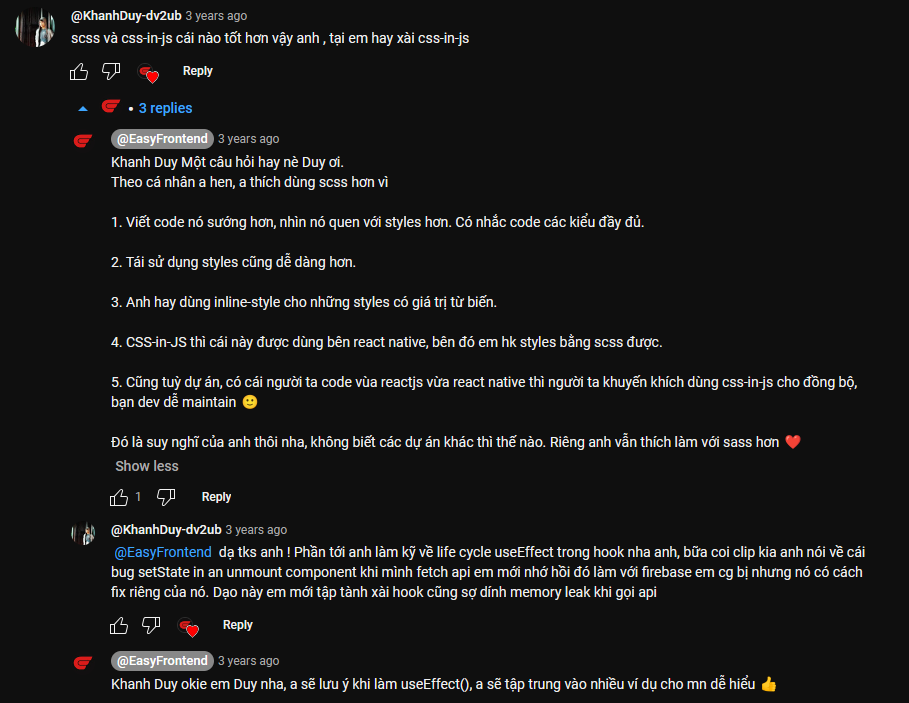

Hướng dẫn tạo project react với create react app để sẵn sàng cho series React hooks.

✅ Hướng dẫn cách code được scss trong react project
✅ Giới thiệu cấu trúc folder, file của project
✅ Sử dụng các extension như: SCSS Formatter, ReactJS Code Snippet.

Link tham khảo:

- Setup create react app: https://create-react-app.dev/docs/getting-started/
- CSS vs SCSS: https://www.geeksforgeeks.org/what-is-the-difference-between-css-and-scss/

**Những bình luận hữu ích**

- Đây là phím tắt để xóa những import nào không dùng đến

