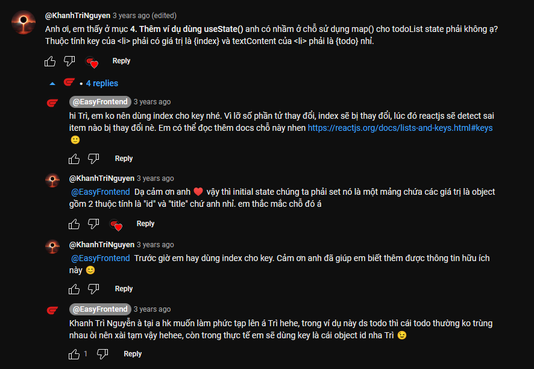
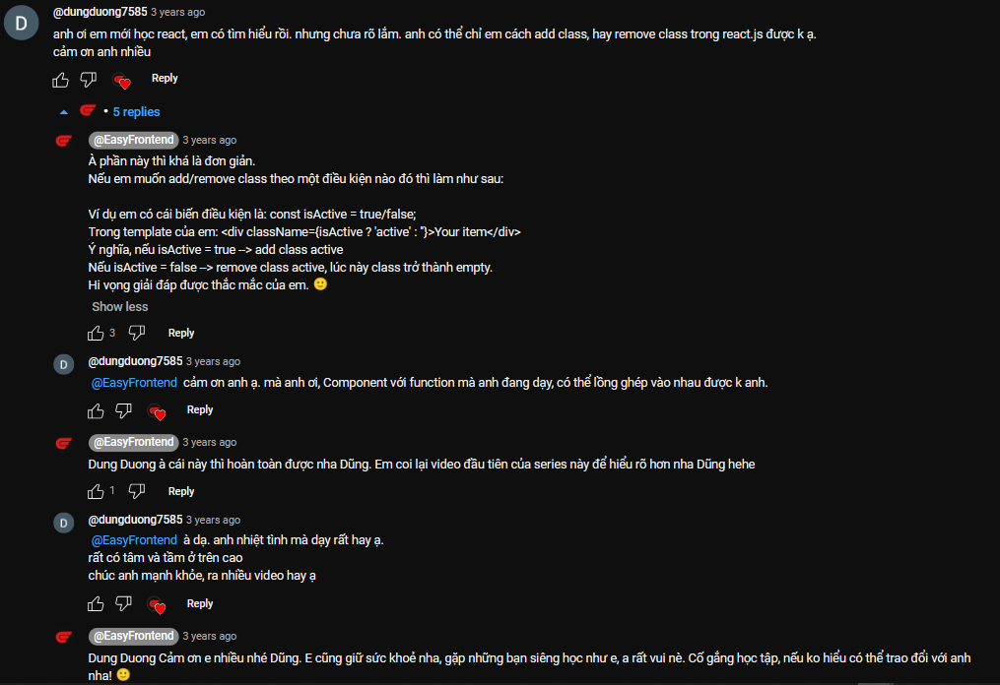
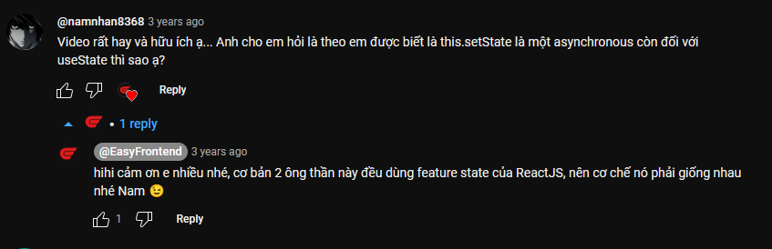
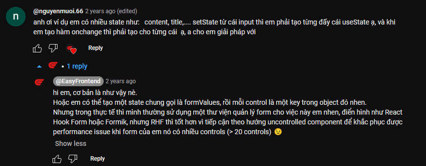
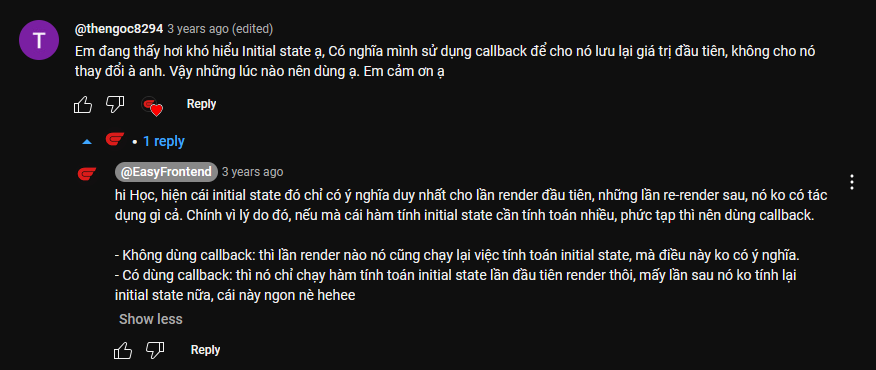
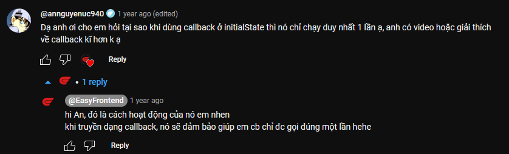
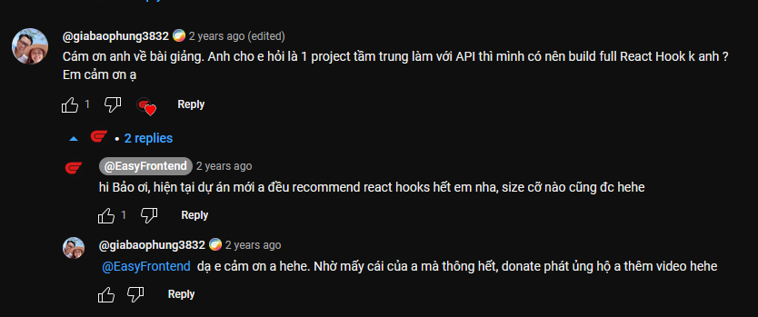

Hướng dẫn sử dụng useState() hook một cách đơn giản, dễ hiểu và một số lưu ý bạn cần biết khi làm việc với useState().

✅ useState() là một hook cơ bản trong các react hooks
✅ Giới thiệu cú pháp array destructoring
✅ useState() trả về một mảng gồm 2 phần tử
✅ useState() sử dụng phương pháp replacing thay vì merging
✅ Giá trị khởi tạo của useState() dạng callback chỉ gọi một lần

🌐 Link tham khảo

- Introduction to react hooks: https://legacy.reactjs.org/docs/hooks-intro.html
- React hooks API reference: https://legacy.reactjs.org/docs/hooks-reference.html
- React hooks FAQ: https://legacy.reactjs.org/docs/hooks-faq.html

**Những bình luận hữu ích**

