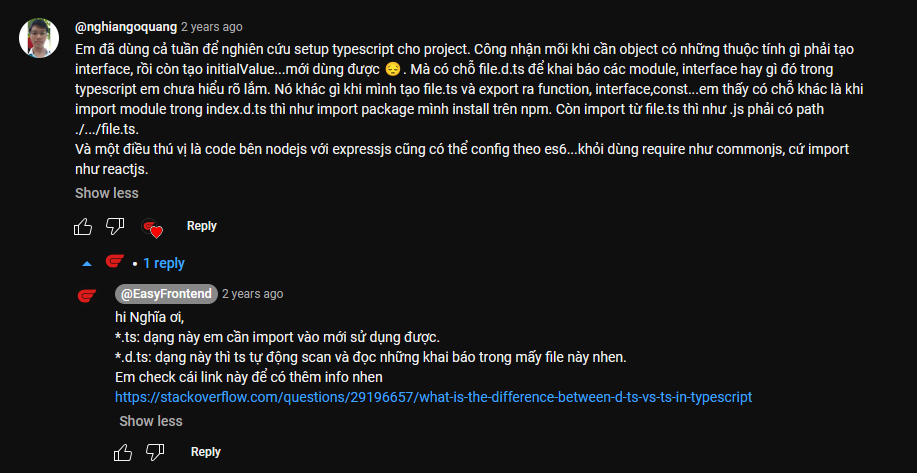
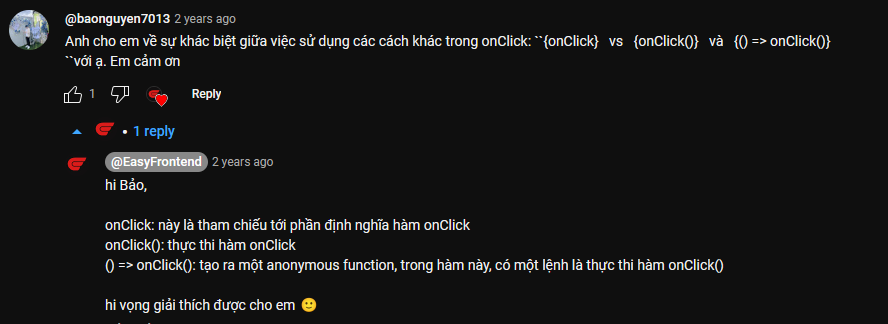
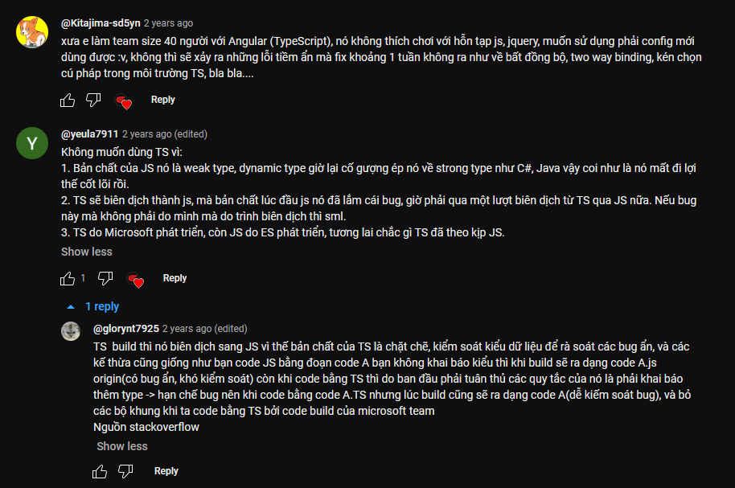
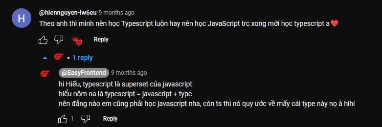

## Video 06: ReactJS - Nên dùng Javascript hay Typescript? 🤔

Bạn đang dùng Javascript hay Typescript cho dự án ReactJS? 😉 Hãy để lại bình luận bên dưới để cho mình biết ý kiến của bạn nhé!

0:00 Giới thiệu video
0:52 Ưu điểm Javascript
2:05 Nhược điểm Javascript
3:18 Khi nào nên dùng Javascript
3:45 Ưu điểm Typescript
5:10 Nhược điểm Typescript
6:13 Khi nào nên dùng Typescript
8:10 Khóa học ReactJS cho người mới bắt đầu trên Udemy

### Những câu hỏi thú vị

1. Em đã dùng cả tuần để nghiên cứu setup typescript cho project. Công nhận mõi khi cần object có những thuộc tính gì phải tạo interface, rồi còn tạo initialValue...mới dùng được 😔. Mà có chỗ file.d.ts để khai báo các module, interface hay gì đó trong typescript em chưa hiểu rõ lắm. Nó khác gì khi mình tạo file.ts và export ra function, interface,const...em thấy có chỗ khác là khi import module trong index.d.ts thì như import package mình install trên npm. Còn import từ file.ts thì như .js phải có path ./.../file.ts. Và một điều thú vị là code bên nodejs với expressjs cũng có thể config theo es6...khỏi dùng require như commonjs, cứ import như reactjs.

- hi Nghĩa ơi,
  - `*.ts`: dạng này em cần import vào mới sử dụng được.
  - `*.d.ts`: dạng này thì ts tự động scan và đọc những khai báo trong mấy file này nhen.
  - Em check cái link này để có thêm info nhen https://stackoverflow.com/questions/29196657/what-is-the-difference-between-d-ts-vs-ts-in-typescript

