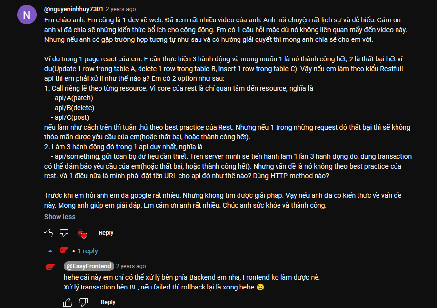
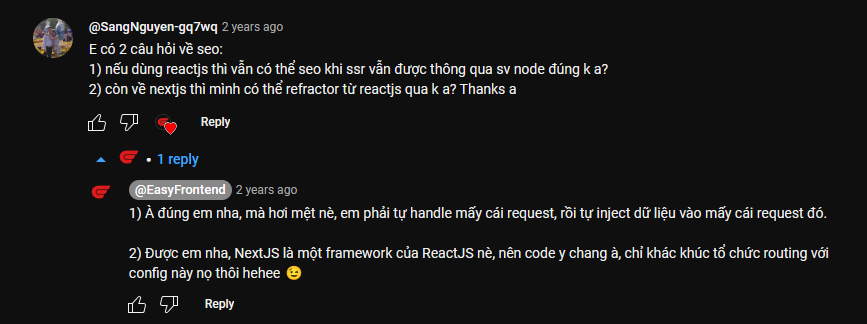
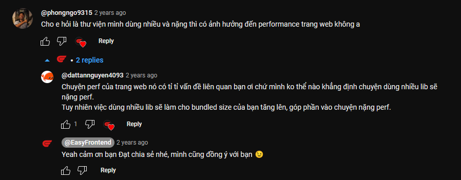
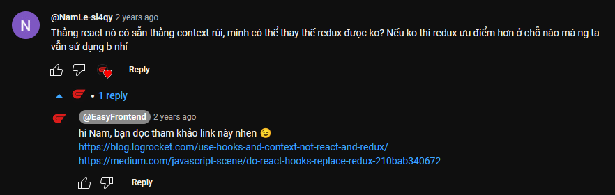
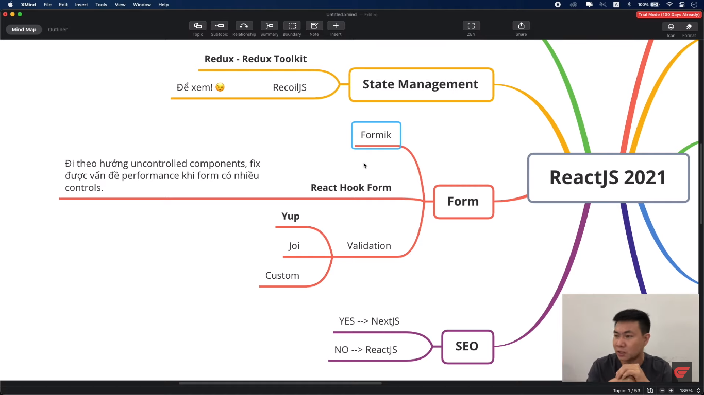
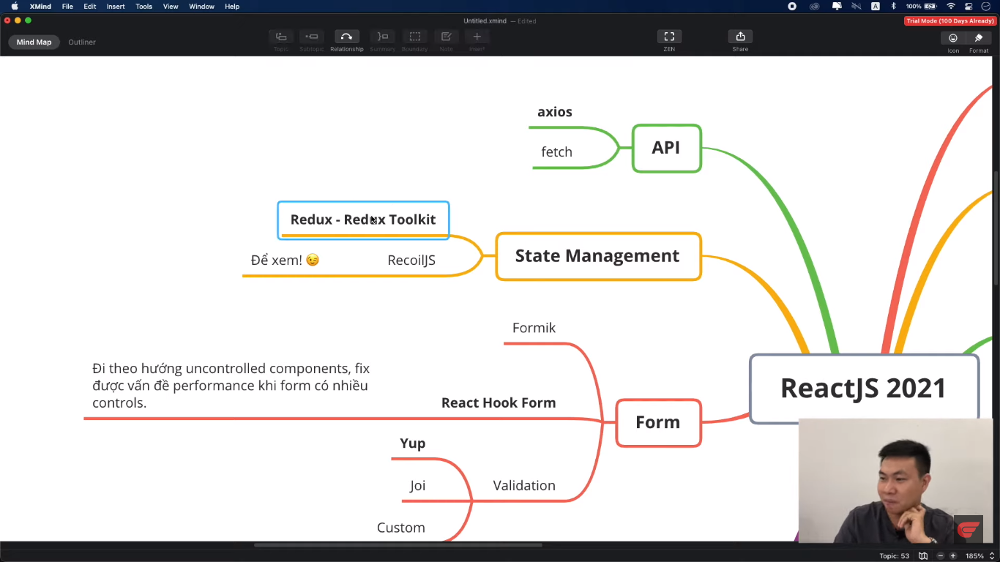
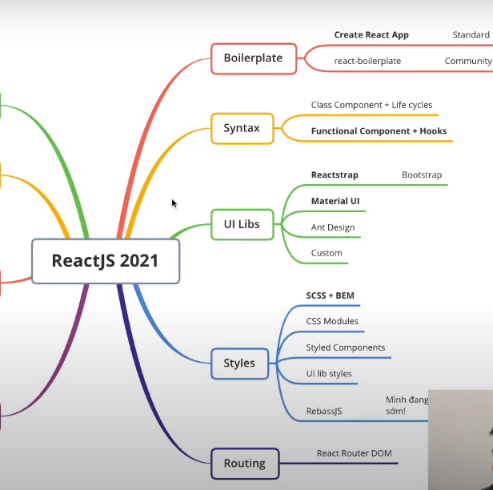

## Video 07: ReactJS - Chọn thư viện cho dự án ReactJS năm 2021 🎉

Bạn đang dùng thư viện nào cho dự án ReactJS năm 2021? Hãy để lại bình luận để cùng nhau trao đổi nhé! 😊

### Những câu hỏi hay

[Link 1](https://blog.logrocket.com/use-hooks-and-context-not-react-and-redux/)
[Link 2](https://medium.com/javascript-scene/do-react-hooks-replace-redux-210bab340672)

---

## Lộ trình học ReactJS

> Trong docs của `Redux` thì nó recommend thằng `Redux Toolkit` luôn, nên mọi người có thể học thằng này

**Cuối cùng thì mình tóm lại**

