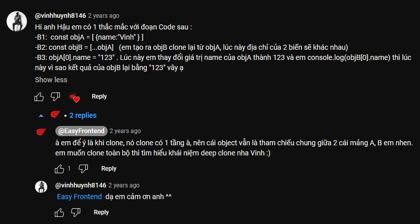
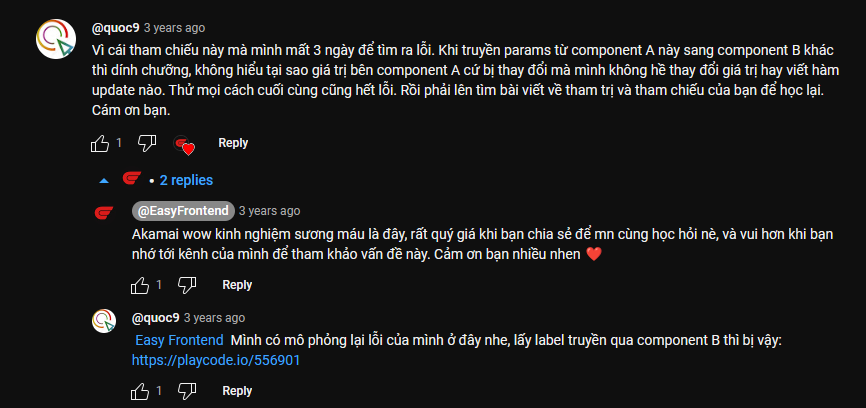

Trong video này mình chia sẻ với các bạn:

1. Tham trị vs tham chiếu là gì?

2. Các khái niệm:

   - stored by value
   - stored by reference
   - pass by value
   - pass by reference

3. Cách khắc phục lỗi liên quan tới reference

4. Có liên quan gì tới ReactJS, Redux hk?

Cùng mình xem hết video để trả lời những câu hỏi trên nhé! 😉

Video này nằm trong chuỗi tài liệu cho javascript cơ bản giúp cho các bạn mới học javascript có thể làm quen với ngôn ngữ javascript này một cách đơn giản, dễ hiểu nhất.

Link tham khảo:

- [Value and reference types](https://codeburst.io/explaining-value-vs-reference-in-javascript-647a975e12a0)

Hình ảnh từ bình luận:

