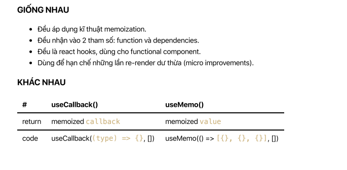

# React hooks: 14 - Giới thiệu Memoization và React.memo (2020) 🎉

Memoization là một kĩ thuật lập trình khá là hay và bạn cũng đã đang sử dụng nó nhưng có thể bạn chưa biết thực sự nó là gì? Cùng mình xem hết video để giải đáp thắc mắc nhé.

Đây là một video trong chuỗi videos về React hooks của mình.

Trong video này, mình sẽ chia sẻ cho các bạn.

✅ Giới thiệu memoization là gì?

✅ Một ví dụ đơn giản sử dụng kĩ thuật memoization

✅ React.memo() có liên quan gì tới memoization

✅ React.memo() là HOC hay là một react hooks?

✅ Sử dụng React.memo() như thế nào và code demo 😉

Hi vọng qua video này giúp các bạn có thể hiểu được về memoization cũng như là React.memo(). Lưu ý, trong video mình có đề cập tới việc khi nào sử dụng React.memo() nữa nhé, đừng bỏ sót nha 😍

---

## Giới thiệu về HOC `React.memo()`

- React.memo() là một HOC, chứ ko phải hooks.
- React.memo() tương tự như PureComponent.
- PureComponent thì cho class component.
- React.memo() dùng cho functional component.
- Chỉrenderlại component nếu props thay đổi.
- Sử dụng shallow comparison.

---

# React hooks: 15 - So sánh useCallback và useMemo 😎 (2020)

🚀 Rối quá rối giữa useCallback và useMemo 😅 Cùng mình tìm hiểu xem 2 ông thần này là gì nhé! Nếu bạn chưa biết memoization là gì thì hãy xem video bài 14 ở đây nhé.

---

# useCallback() vs useMemo() 😎

- useCallback() là gì?
- useMemo() là gì?
- So sánh useCallback() vs useMemo()
- Có nên sử dụng useCallback() vs useMemo() hay không?
- Link tham khảo

1. useCallback() là gì?

- Là mộtreact hooks giúp mình tạo ra một memoized callback và chỉ tạo ra callback mới khi
- dependencies thay đổi.
- Nhận vào 2 tham số: 1 là function, 2 là dependencies.
- Return memoized callback
- Chỉ tạo ra function mới khi dependencies thay đổi.
- Nếu dùng empty dependencies thì không bao giờ tạo ra function mới.

```js
// Mỗi lần App re-render
// --> tạo ra một function mới
// --> Chart bị re-render
function App() {
  const handleChartTypeChange = (type) => {}
  return <Chart onTypeChange={handleChartTypeChange} />
}
```

```js
// Mỗi lần App re-render
// --> nhờ có useCallback() nó chỉ tạo function một lần đầu
// --> Nên Chart ko bị re-render.
function App() {
const handleChartTypeChange = useCallback((type) => {}, [])
return <Chart onTypeChange={handleChartTypeChange} />;
}

React Hooks: 15 - So sánh useCallback vs useMemo 😎 | Easy Frontend 4/16/2020
```

2. useMemo() là gì?

- Là mộtreact hooks giúp mình tạo ra một memoized value và chỉ tính toán ra value mới khi
- dependencies thay đổi.
- Nhận vào 2 tham số: 1 là function, 2 là dependencies.
- Return memoized value
- Chỉ tính toán value mới khi dependencies thay đổi.
- Nếu dùng empty dependencies thì không bao giờ tính toán lại value mới.

```js
// Mỗi lần App re-render
// --> tạo ra một mảng mới
// --> Chart bị re-render do props thay đổi
function App() {
  const data = [{}, {}, {}]
  return <Chart data={data} />
}
```

```js
// Mỗi lần App re-render
// --> nhờ có useMemo() nó chỉ tạo ra cái mảng 1 lần đầu
// --> Nên Chart ko bị re-render.
function App() {
  const data = useMemo(() => [{}, {}, {}], [])
  return <Chart data={data} />
}
```

3. So sánh useCallback() vs useMemo()

- GIỐNG NHAU

  - Đều áp dụng kĩ thuật memoization.
  - Đều nhận vào 2 tham số: function và dependencies.
  - Đều là react hooks, dùng cho functional component.
  - Dùng để hạn chế những lần re-render dư thừa (micro improvements).

- KHÁC NHAU

## useCallback() useMemo()



4. Có nên sử dụng useCallback() vs useMemo() hay không?

- Không nên dùng cho tất cả components.
- Nên dùng cho: đồ thị, biểu đồ, animations, những component nặng phần render.
- Chỉ là micro improvements.

5. Link tham khảo

- useCallback() hooks: https://reactjs.org/docs/hooks-reference.html#usecallback
- useMemo() hooks: https://reactjs.org/docs/hooks-reference.html#usememo

- Một bài blog rất hay về useMemo và useCallback: https://kentcdodds.com/blog/usememo-and-usecallback

- https://medium.com/@jan.hesters/usecallback-vs-usememo-c23ad1dc60
- https://dev.to/dinhhuyams/introduction-to-react-memo-usememo-and-usecallback-5ei3
